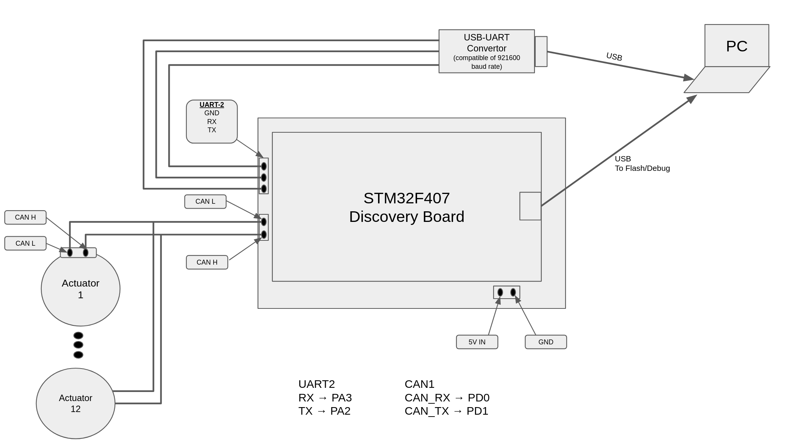

# hyperdog.AI-microROS-workspace

micro-ROS powered embedded low-level firmware of HyperDog-AI quadruped robot, and necessary ROS2 (foxy) packages.

- [1. Build ROS 2 packages](#1-build-ros-2-packages)
- [2. Build and flash the firmware](#2-build-and-flash-the-firmware)
    - [2.1 Install ARM compiler for building and debuging the firmware](#21-install-arm-compiler-for-building-and-debuging-the-firmware)
    - [2.2 Build](#22-build)
    - [2.3 flash](#23-flash)
- [3. Hardware setup](#3-hardware-setup)
- [4. Connect microROS agent with stm32F407 microcontroller](#4-connect-microros-agent-with-stm32f407-microcontroller)
- [5. hyperdog_uros_node](#5-hyperdog_uros_node)
    - [5.1 initLegMotors Server](#51-initlegmotors-server)
    - [5.2 enableAllMotors Server](#52-enableallmotors-server)
    - [5.3 disableAllMotors Server](#53-disableallmotors-server)
    - [5.4 setMotorZeroPosition Server](#54-setmotorzeroposition-server)
    - [5.5 motors_states Publisher](#55-motors_states-publisher)
    - [5.6 motor_cmd Subscriber](#56-motor_cmd-subscriber)
- [6. hyperdog_ctrl_legs Node](#6-hyperdog_ctrl_legs-node)
    - [6.1 initMotors client](#61-initmotors-client)
    - [6.2 enableAllMotors client](#62-enableallmotors-client)
    - [6.3 disableAllMotors client](#63-disableallmotors-client)
    - [6.4 setMotorZeroPosition client](#64-setmotorzeroposition-client)

    
## 1. Build ROS 2 packages
In the `src` consists of `hyperdog_uros_msgs`, `micro-ros-setup` and `micro-ROS-Agent` packages. 
Create a ROS 2 workspace and build these packages:
```
# source 
source /opt/ros/foxy/setup.bash

# create a workspace
mkdir hypwerdogAI_ROS2_ws && cd hyperdogAI_ROS2_ws

# clone the repository with sub modules
git clone --recurse-submodules https://github.com/NDHANA94/hyperdog.AI-microROS-workspace.git

# build submodules (micro-ros-setup, micro-ROS-Agent)
colcon build
source instal/local_setup.bash
```

## 2. Build and flash the firmware:

To build the firmware, use VS-Code with `c/c++`, `CMake`, `Cortex-Debug` extensions.

### 2.1 Install ARM compiler for building and debuging the firmware:

- If there is already installed `gcc-arm-none-eabi` package, remove it using following command:
    ```
    sudo apt remove gcc-arm-none-eabi
    ```
- Download the latest version of `gcc-arm-none-eabi` for Linux x86_64:
[link](https://developer.arm.com/-/media/Files/downloads/gnu-rm/10.3-2021.10/gcc-arm-none-eabi-10.3-2021.10-x86_64-linux.tar.bz2?rev=78196d3461ba4c9089a67b5f33edf82a&hash=5631ACEF1F8F237389F14B41566964EC)

- Extract the downloaded Tarball
    ```
    sudo tar xjf gcc-arm-none-eabi-<VERSION>.bz2 -C /usr/share/
    ```
- Create Symbolic links:
    ```
    sudo ln -s /usr/share/gcc-arm-none-eabi-<VERSION>/bin/arm-none-eabi-gcc /usr/bin/arm-none-eabi-gcc 
    sudo ln -s /usr/share/gcc-arm-none-eabi-<VERSION>/bin/arm-none-eabi-g++ /usr/bin/arm-none-eabi-g++
    sudo ln -s /usr/share/gcc-arm-none-eabi-<VERSION>/bin/arm-none-eabi-gdb /usr/bin/arm-none-eabi-gdb
    sudo ln -s /usr/share/gcc-arm-none-eabi-<VERSION>/bin/arm-none-eabi-size /usr/bin/arm-none-eabi-size
    sudo ln -s /usr/share/gcc-arm-none-eabi-<VERSION>/bin/arm-none-eabi-objcopy /usr/bin/arm-none-eabi-objcopy

    ```

### 2.2 Build:
-   Build the firmware using fllowing command: 
    ```
    cd firmware-stm32f407-micro-ros/
    make all
    ```

### 2.3 flash:
- flash the generated `hyperdog_ai-uros-controller-stm32f4.bin` file in the directory of `firmware-stm32f407-microros/Build/` to stm32 microcontroller using `st-utils`: 
    ```bash
    st-flash write hyperdog_ai-uros-controller-stm32f4.bin 0x8000000
    ```

## 3. Hardware setup:
- microROS communicates with microROS agent via UART serial interface. 
- STM32F407 has no CAN controller. Hence, use can controller to get CAN-H/CAN-L interface from CAN-RX/CAN-TX interface.



## 4. Connect microROS agent with stm32F407 microcontroller
In order to communicate with micro-ROS node via ROS 2 ecosystem, We have to run the `micro-ros-agent` first.
Micro-ros-agent acts as a bridge between the ROS 2 and Micro-ROS nodes running on microcontroller.
To connect microROS agent with the stm32 micro-ros application, install micro-ros-agent pkg and run following command;
```bash
ros2 run micro_ros_agent micro_ros_agent serial -b 921600 --dev /dev/ttyUSB0
```

IMPORTANT: Choose a UART-USB converter which is compatible with 921600 baudrate (ex: CP2102).

## 5. `hyperdog_uros_node`
STM32 Firmware is developed with `hyperdog_uros_node` which consists following server, subscriber and publisher entities;

|   Name of Entity |    Type     | Purpose | 
|---|---|---|
| `initLegMotors` | Server | To initialize motor instances |  
| `enableAllMotors` | Server | To enable motors |
| `disableAllMotors` | Server | To disable motors |
| `setMotorZeroPosition` | Server | To set zero position of desired motor |
| `motors_states` | Publisher | Publish states of the motors |
| `motor_cmd` | Subscriber | To get motor commands |

### 5.1 `initLegMotors` Server:
This server allocates memory for 12 motor instances and initializes motor parameters of each motors which are provided by the [`initMotors` client](#61-initmotors-client).
In order to communicate with the motors, one should firstly call this server with proper motor parameters.
12 motor instances are named as following;
-   `fr_hip_roll` : hip roll joint actuator of front-right leg
-   `fr_hip_pitch` : hip pitch joint actuator of front-right leg
-   `fr_knee` : knee joint actuator of front-right leg
-   `fl_hip_roll` : hip roll joint actuator of front-left leg
-   `fl_hip_pitch` : hip pitch joint actuator of front-left leg
-   `fl_knee` : knee joint actuator of front-left leg
-   `rr_hip_roll` : hip roll joint actuator of rear-right leg
-   `rr_hip_pitch` : hip pitch joint actuator of rear-right leg
-   `rr_knee` : knee joint actuator of rear-right leg
-   `rl_hip_roll` : hip roll joint actuator of rear-left leg
-   `rl_hip_pitch` : hip pitch joint actuator of rear-left leg
-   `rl_knee` : knee joint actuator of rear-left leg

If at-least one of the motor parameters which client passes has an error, server responses with a none zero `error_code`. If everything is allright, then the server responses with a zero `error_code`.  See [Error Codes](#error-codes) section for more details about error codes. </br>
Once the `initLegMotors` server is called by the client with proper motor parameters, you can start communicating with motors.

### 5.2 `enableAllMotors` Server:
In order to control the motors, you should firstly enable the motors. Once you call the `enableAllMotors` service by running [`enableAllMotors` client](#62-enableallmotors-client).

### 5.3 `disableAllMotors` Server:
To disable all the motors at once, you can call `disableAllMotors` service by running [`disableAllMotors` client](#63-disableallmotors-client).

### 5.4 `setMotorZeroPosition` Server:
To set current position as the motor's zero position, you can this server by running [`setMotorZeroPosition` client](#64-setmotorzeroposition-client).

### 5.5 `motors_states` Publisher:
This publisher publishes current states of each 12 motors via `motors_states` topic by using `MotorsStates.msg` interface. Following data variables are consisted for each 12 motors in this topic:
| Variable | Data Type | Description |
|---|---|---|
| is_available | bool | 1 if motor is available in the CAN bus, else 0. |
| is_enabled | bool | 1 if motor is enabled, else 0. |
| is_error | bool | 1 if an error exists, else 0 |
| error_code | uint16 | Error code which describes the error |
| status msg | string | Curent status of the motor: `NOT_INITIALIZED`, `INITIALIZED`, `DISABLED`, `ENABLED`, `OFFLINE`, `ERROR`, `CAN_ERROR` |
| feedback | uint8[6] | Encoded motor feedback data (position, velocity, torque) |

To get the decoded motors feedback, the `motor_states_decoder` package can be used by running following terminal command.
```bash
ros2 run motor_states_decoder motor_states_decoder_node
```
 
### 5.6 `motor_cmd` Subscriber:
To send a command to desire motor `motor_cmd` topic can be used. This topic uses `MotorCmd.msg` interface which has following data;
|Data|Data Type|Options|Description|
|---|---|---|---|
|leg|uint8| `0`:Front Right leg.  `1`:Front Left Leg. `2`:Rear Right Leg. `3`:Rear Left Leg | Select the desire leg to send the command|
|joint|uint8| `0`:Hip Roll Joint. `1`:Hip Pitch Joint. `2`:Knee Joint.| Select the desire joint motor to send the command |
|enable|bool|`true` or `false` | if `true` sends enable command to the selected motor |
|disable|bool|`true` or `false` | if `true` sends disable command to the selected motor |
|set_zero|bool|`true` or `false` | if `true` sends zero position command to the selected motor |
|desire_position| float32 | -|To set motor position to desired position|
|desire_velocity| float32 | -|To set motor velocity to desired velocity |
|kp | float32 |-| To set motor stiffness (Kp value) |
|kd | float32 |-| To set motor damping (Kd value) |
|i_ff|float32|-| To set feed forward current |


## 6. `hyperdog_ctrl_legs` Node
`hyperdog_ctrl_legs` node has following clients to communicate with the microros servers, subscribers and publishers;

### 6.1 `initMotors` client:
By running this client you can initialize the motor controlling process. When you run this client, it sends the motor parameters of each 12 motors which are configured in the `src/hyperdog_ctrl_legs/config/initLegMotors_param.yaml` file. You can run this client using following terminal command:
```bash
ros2 run hyperdog_ctrl_legs initMotors
```
[Server](#51-initlegmotors-server) will response to this client requent with the information whether the initialization of motors was succeed or if not what was the error.

### 6.2 `enableAllMotors` client:
By running this client you can enable all the motors connected to the CAN bus at once.
To run this client and enable all the motors, use following terminal command:
```bash
ros2 run hyperdog_ctrl_legs enableAllMotors
```
Server will response to this client request with information such as; whether the motors were enbled or not and if a motor was not enabled what was the reason (error).

### 6.3 `disableAllMotors` client:
By running this client you can disable all the motors connected to the CAN bus at once.
To run this client and disable all the motors, use following terminal command:
```bash
ros2 run hyperdog_ctrl_legs disableAllMotors
```
Server will response to this client request with information such as; whether the motors were disabled or not and if a motor was not disabled what was the reason (error).

### 6.4 `setMotorZeroPosition` client:
By running this client you can set the current motor position as zero position for a selected motor.
To select which motor you want to set zero position use following option words with the command;
| Motor | Option Word |
|---|---|
| Hip Roll motor of the Front Right Leg | fr_hip_roll |
| Hip Pitch motor of the Front Right Leg | fr_hip_pitch |
| Knee motor of the Front Right Leg | fr_knee |
| Hip Roll motor of the Front Left Leg | fl_hip_roll |
| Hip Pitch motor of the Front Left Leg | fl_hip_pitch |
| Knee motor of the Front Left Leg | fl_knee |
| Hip Roll motor of the Rear Right Leg | rr_hip_roll |
| Hip Pitch motor of the Rear Right Leg | rr_hip_pitch |
| Knee motor of the Rear Right Leg | rr_knee |
| Hip Roll motor of the Rear Left Leg | rl_hip_roll |
| Hip Pitch motor of the Rear Left Leg | rl_hip_pitch |
| Knee motor of the Rear Left Leg | rl_knee |

Example: To set knee motor of the Front Left motor, run following terminal command
```bash
ros2 run hyperdog_ctrl_legs setMotorZeroPosition fl_knee
```
Server will reply to this request with an aproximate 2 seconds delay whether the motor received the command or not.

IMPORTANT: Make sure to set the motor into disable mode befor setting zero position and after setting zero position do a power cycling.


### Error Codes

TODO
<!-- 

BUGS:

    1. best_effort publisher doesn't publish the larger msgs. 
        - micro_ros_stm32cubemx_utils's default MTU value is 512 (microros_include/uxr/client/config.h). 
        The msg i wanted to send is 768 bytes large.
        - micro_ros_stm32cubemx_util's provides with a dma_transport.c which assigns 2048 bytes DMA_BUFFER_SIZE.
        - I tried to increase UXR_CONFIG_CUSTOM_TRANSPORT_MTU value to 800, 1024, ect.. then error occered at 
        at the line 56 in dma_transport.c file. after this line the program goes to HardFault_Handler() and stops freertos. 
        - I tried to set DMA_BUFFER_SIZE and UXR_CONFIG_CUSTOM_TRANSPORT_MTU value as following;
                                DMA_BUFFER_SIZE = UXR_CONFIG_CUSTOM_TRANSPORT_MTU * 4
            This way also i get the same error as before.

         


 -->