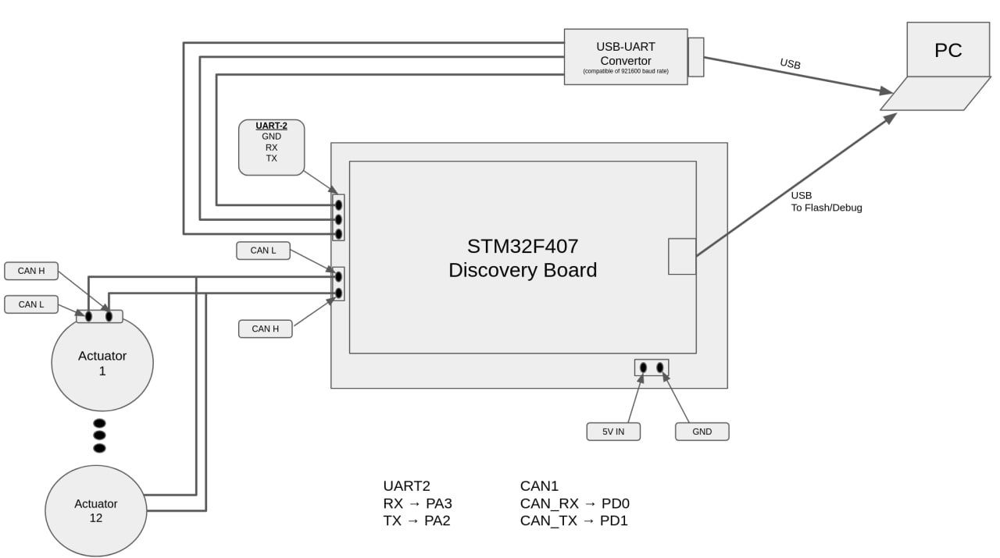

# hyperdog.AI-microROS-workspace

micro-ROS powered embedded low-level firmware of HyperDog-AI quadruped robot, and necessary ROS2 (foxy) packages.


## Build ROS 2 packages
In the `src` consists f `hyperdog_uros_msgs`, `micro-ros-setup` and `micro-ROS-Agent` packages. 
Create a ROS 2 workspace and build these packages:
```
# source 
source /opt/ros/foxy/setup.bash

# create a workspace
mkdir hypwerdogAI_ROS2_ws && cd hyperdogAI_ROS2_ws

# clone the repository with sub modules
git clone --recurse-submodules https://github.com/NDHANA94/hyperdog.AI-microROS-workspace.git

# build submodules (micro-ros-setup, micro-ROS-Agent)
colcon build
source instal/local_setup.bash
```

## Build the firmware:

To build the firmware, use VS-Code with `c/c++`, `CMake`, `Cortex-Debug` extensions.

### Install ARM compiler for building and debuging the firmware:

- If there is already installed `gcc-arm-none-eabi` package, remove it using following command:
    ```
    sudo apt remove gcc-arm-none-eabi
    ```
- Download the latest version of `gcc-arm-none-eabi` for Linux x86_64:
[link](https://developer.arm.com/-/media/Files/downloads/gnu-rm/10.3-2021.10/gcc-arm-none-eabi-10.3-2021.10-x86_64-linux.tar.bz2?rev=78196d3461ba4c9089a67b5f33edf82a&hash=5631ACEF1F8F237389F14B41566964EC)

- Extract the downloaded Tarball
    ```
    sudo tar xjf gcc-arm-none-eabi-<VERSION>.bz2 -C /usr/share/
    ```
- Create Symbolic links:
    ```
    sudo ln -s /usr/share/gcc-arm-none-eabi-<VERSION>/bin/arm-none-eabi-gcc /usr/bin/arm-none-eabi-gcc 
    sudo ln -s /usr/share/gcc-arm-none-eabi-<VERSION>/bin/arm-none-eabi-g++ /usr/bin/arm-none-eabi-g++
    sudo ln -s /usr/share/gcc-arm-none-eabi-<VERSION>/bin/arm-none-eabi-gdb /usr/bin/arm-none-eabi-gdb
    sudo ln -s /usr/share/gcc-arm-none-eabi-<VERSION>/bin/arm-none-eabi-size /usr/bin/arm-none-eabi-size
    sudo ln -s /usr/share/gcc-arm-none-eabi-<VERSION>/bin/arm-none-eabi-objcopy /usr/bin/arm-none-eabi-objcopy

    ```

### Build:
-   Build the firmware using fllowing command: 
    ```
    cd firmware-stm32f407-micro-ros/
    make all
    ```
## flash:
- flash the generated `hyperdog_ai-uros-controller-stm32f4.bin` file in the directory of `firmware-stm32f407-microros/Build/` to stm32 microcontroller.
    using `st-utils`: 
    ```bash
    st-flash write hyperdog_ai-uros-controller-stm32f4.bin 0x8000000
    ```

## Hardware setup:


<!-- 

BUGS:

    1. best_effort publisher doesn't publish the larger msgs. 
        - micro_ros_stm32cubemx_utils's default MTU value is 512 (microros_include/uxr/client/config.h). 
        The msg i wanted to send is 768 bytes large.
        - micro_ros_stm32cubemx_util's provides with a dma_transport.c which assigns 2048 bytes DMA_BUFFER_SIZE.
        - I tried to increase UXR_CONFIG_CUSTOM_TRANSPORT_MTU value to 800, 1024, ect.. then error occered at 
        at the line 56 in dma_transport.c file. after this line the program goes to HardFault_Handler() and stops freertos. 
        - I tried to set DMA_BUFFER_SIZE and UXR_CONFIG_CUSTOM_TRANSPORT_MTU value as following;
                                DMA_BUFFER_SIZE = UXR_CONFIG_CUSTOM_TRANSPORT_MTU * 4
            This way also i get the same error as before.

         


 -->